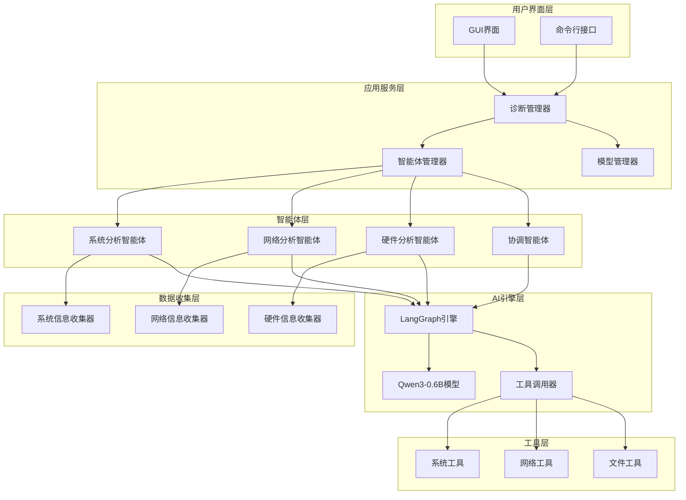
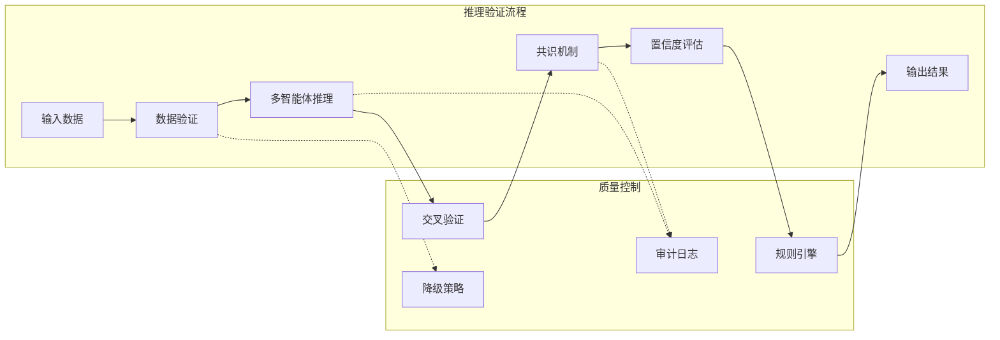
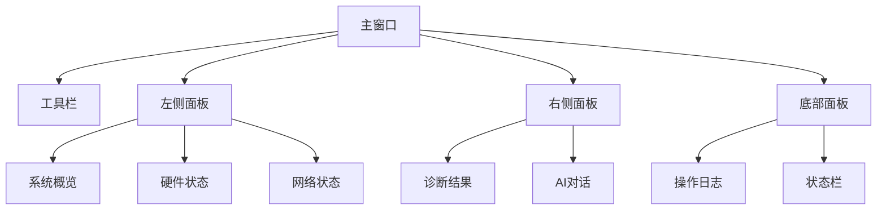

# 系统诊断工具设计文档

## 概述

本项目旨在开发一个智能系统诊断工具，通过收集系统硬件资源、运行状态和网络状态等信息，使用端侧轻量级AI模型（Qwen3-0.6B）和多智能体协同技术进行智能诊断和问题分析。工具提供友好的GUI界面，支持跨平台运行，让非技术人员也能轻松使用。

### 核心特性
- 多维度系统信息收集（硬件、系统状态、网络）
- 基于Qwen3-0.6B的端侧AI诊断
- LangGraph多智能体协同分析
- 跨平台支持（Windows、macOS、Linux）
- 用户友好的GUI界面
- 自动模型下载和管理
- 工具调用能力扩展

## 技术栈

### 项目管理
- **包管理器**: uv (快速Python包管理器)
- **版本控制**: Git
- **依赖管理**: pyproject.toml + uv.lock
- **虚拟环境**: uv管理的Python虚拟环境

### 核心技术
- **编程语言**: Python 3.9+
- **AI框架**: LangChain + LangGraph
- **模型**: Qwen/Qwen3-0.6B (通过transformers库)
- **GUI框架**: PyQt6 (现代化跨平台GUI框架)
- **系统信息收集**: psutil, platform, subprocess
- **网络监控**: requests, ping3, netifaces
- **模型管理**: huggingface_hub

### 辅助库
- **配置管理**: pydantic, yaml
- **日志**: loguru
- **多线程**: threading, asyncio
- **打包**: PyInstaller
- **图表**: matplotlib, plotly, pyqtgraph
- **系统集成**: QSystemTrayIcon, QNotification
- **主题支持**: qdarkstyle, qt-material

## 架构设计

### 整体架构



### 多智能体协同架构 - 严谨性设计

#### AI推理严谨性保障


#### 严谨性设计原则
1. **多智能体共识机制**: 至少3个智能体参与决策，采用投票机制
2. **置信度量化**: 每个诊断结果都有明确的置信度分数
3. **规则引擎兜底**: AI无法确定时使用专家规则
4. **审计追踪**: 完整记录推理过程和决策依据
5. **降级策略**: AI失效时自动切换到传统诊断方法

#### 思考推理模型输出支持

```python
class ChainOfThoughtOutput(BaseModel):
    """思考链输出结构"""
    thought_steps: List[str] = Field(description="思考步骤")
    reasoning_chain: List[Dict[str, Any]] = Field(description="推理链")
    intermediate_conclusions: List[str] = Field(description="中间结论")
    confidence_evolution: List[float] = Field(description="置信度变化")
    evidence_used: List[str] = Field(description="使用的证据")
    assumptions_made: List[str] = Field(description="做出的假设")
    alternative_hypotheses: List[str] = Field(description="替代假设")
    
class ReasoningAgent(ReactiveAgent):
    """支持思考推理的智能体"""
    
    def __init__(self, name: str, llm, tools: List[Tool], system_prompt: str):
        super().__init__(name, llm, tools, system_prompt)
        self.thought_parser = ThoughtChainParser()
        self.reasoning_validator = ReasoningValidator()
        
    async def execute_with_reasoning(self, input_data: str) -> AsyncGenerator[Dict[str, Any], None]:
        """执行带有思考推理的任务"""
        try:
            # 1. 初始化思考链
            thought_chain = ThoughtChain()
            
            # 2. 分段推理执行
            reasoning_stages = [
                "问题理解",
                "信息收集", 
                "假设生成",
                "证据分析",
                "结论推导",
                "结果验证"
            ]
            
            for stage in reasoning_stages:
                yield {
                    "type": "reasoning_stage",
                    "stage": stage,
                    "agent_name": self.name,
                    "timestamp": datetime.now().isoformat()
                }
                
                # 执行当前阶段的推理
                stage_result = await self._execute_reasoning_stage(stage, input_data, thought_chain)
                
                yield {
                    "type": "reasoning_result",
                    "stage": stage,
                    "result": stage_result,
                    "thought_chain": thought_chain.get_current_state(),
                    "confidence": stage_result.get("confidence", 0.0)
                }
                
                # 验证推理质量
                validation_result = self.reasoning_validator.validate_stage(stage_result)
                if not validation_result.is_valid:
                    yield {
                        "type": "reasoning_error",
                        "stage": stage,
                        "error": validation_result.error_message,
                        "suggested_action": validation_result.suggested_action
                    }
                    break
                    
            # 3. 生成最终结果
            final_result = self._generate_final_reasoning_result(thought_chain)
            
            yield {
                "type": "reasoning_complete",
                "result": final_result.dict(),
                "thought_chain_summary": thought_chain.get_summary(),
                "total_confidence": final_result.confidence_score
            }
            
        except Exception as e:
            yield {
                "type": "reasoning_error",
                "error": str(e),
                "stage": "execution"
            }
            
    async def _execute_reasoning_stage(self, stage: str, input_data: str, 
                                     thought_chain: 'ThoughtChain') -> Dict[str, Any]:
        """执行具体的推理阶段"""
        
        stage_prompts = {
            "问题理解": f"""
请仔细理解以下系统诊断问题:
{input_data}

请按照以下步骤思考:
1. 识别核心问题
2. 确定关键信息
3. 列出可能的原因
4. 评估问题的优先级

请提供你的思考过程和初步结论。
            """,
            
            "信息收集": f"""
基于之前的问题理解，现在需要收集相关信息:
{input_data}

当前思考链: {thought_chain.get_summary()}

请思考:
1. 需要哪些具体数据
2. 如何获取这些数据
3. 数据的可靠性如何
4. 还缺少哪些信息

请使用可用的工具收集信息并提供你的分析。
            """
        }
        
        prompt = stage_prompts.get(stage, f"执行{stage}阶段的推理")
        
        # 调用LLM进行推理
        response = await self.llm.ainvoke(prompt)
        
        # 解析思考过程
        thought_result = self.thought_parser.parse_response(response.content)
        
        # 更新思考链
        thought_chain.add_stage(stage, thought_result)
        
        return {
            "stage": stage,
            "thoughts": thought_result.thought_steps,
            "reasoning": thought_result.reasoning_chain,
            "confidence": thought_result.confidence_score,
            "evidence": thought_result.evidence_used,
            "timestamp": datetime.now().isoformat()
        }
        
class ThoughtChain:
    """思考链管理器"""
    
    def __init__(self):
        self.stages = []
        self.overall_confidence = 0.0
        self.key_insights = []
        
    def add_stage(self, stage_name: str, thought_result: ChainOfThoughtOutput):
        """添加推理阶段"""
        self.stages.append({
            "stage": stage_name,
            "result": thought_result,
            "timestamp": datetime.now().isoformat()
        })
        
        # 更新整体置信度
        self._update_overall_confidence()
        
    def get_current_state(self) -> Dict[str, Any]:
        """获取当前思考链状态"""
        return {
            "stages_completed": len(self.stages),
            "current_confidence": self.overall_confidence,
            "key_insights": self.key_insights,
            "latest_thoughts": self.stages[-1]["result"].thought_steps if self.stages else []
        }
        
    def get_summary(self) -> str:
        """获取思考链摘要"""
        if not self.stages:
            return "暂无思考记录"
            
        summary_parts = []
        for stage in self.stages:
            stage_summary = f"{stage['stage']}: {stage['result'].intermediate_conclusions[0] if stage['result'].intermediate_conclusions else '无结论'}"
            summary_parts.append(stage_summary)
            
        return " -> ".join(summary_parts)
        
    def _update_overall_confidence(self):
        """更新整体置信度"""
        if self.stages:
            confidences = [stage["result"].confidence_score for stage in self.stages]
            self.overall_confidence = sum(confidences) / len(confidences)
            
class ThoughtChainParser:
    """思考链解析器"""
    
    def parse_response(self, response_text: str) -> ChainOfThoughtOutput:
        """解析LLM响应中的思考过程"""
        # 使用正则表达式提取思考步骤
        import re
        
        thought_pattern = r'思考[\s]*[:：]([\s\S]*?)(?=\n\n|结论|假设|$)'
        reasoning_pattern = r'推理[\s]*[:：]([\s\S]*?)(?=\n\n|结论|$)'
        conclusion_pattern = r'结论[\s]*[:：]([\s\S]*?)(?=\n\n|$)'
        
        thought_steps = re.findall(thought_pattern, response_text)
        reasoning_chains = re.findall(reasoning_pattern, response_text) 
        conclusions = re.findall(conclusion_pattern, response_text)
        
        return ChainOfThoughtOutput(
            thought_steps=[step.strip() for step in thought_steps],
            reasoning_chain=self._parse_reasoning_chain(reasoning_chains),
            intermediate_conclusions=[conc.strip() for conc in conclusions],
            confidence_evolution=[0.5],  # 默认值
            evidence_used=[],
            assumptions_made=[],
            alternative_hypotheses=[],
            confidence_score=0.5
        )
        
    def _parse_reasoning_chain(self, reasoning_texts: List[str]) -> List[Dict[str, Any]]:
        """解析推理链"""
        reasoning_chain = []
        for i, text in enumerate(reasoning_texts):
            reasoning_chain.append({
                "step": i + 1,
                "content": text.strip(),
                "type": "deduction"
            })
        return reasoning_chain
        
class ReasoningValidator:
    """推理验证器"""
    
    def validate_stage(self, stage_result: Dict[str, Any]) -> 'ValidationResult':
        """验证推理阶段的质量"""
        confidence = stage_result.get("confidence", 0.0)
        thoughts = stage_result.get("thoughts", [])
        reasoning = stage_result.get("reasoning", [])
        
        # 检查验证条件
        if confidence < 0.3:
            return ValidationResult(
                is_valid=False,
                error_message="推理置信度过低",
                suggested_action="需要更多证据或重新分析"
            )
            
        if len(thoughts) < 2:
            return ValidationResult(
                is_valid=False,
                error_message="思考步骤不够详细",
                suggested_action="需要更多的思考步骤"
            )
            
        return ValidationResult(
            is_valid=True,
            error_message="",
            suggested_action=""
        )
```

class AIReasoningEngine:
    """增强的AI推理引擎，支持思考链和严谨性验证"""
    
    def __init__(self):
        self.agents = {
            'hardware': HardwareAnalysisAgent(),
            'system': SystemAnalysisAgent(), 
            'network': NetworkAnalysisAgent(),
            'validator': ValidationAgent()
        }
        self.rule_engine = ExpertRuleEngine()
        self.confidence_threshold = 0.7
        self.audit_logger = AuditLogger()
        self.reasoning_aggregator = ReasoningAggregator()
        
    async def diagnose_with_reasoning_consensus(self, data: SystemData) -> AsyncGenerator[Dict[str, Any], None]:
        """带有思考推理的共识诊断"""
        try:
            # 1. 初始化阶段
            yield {
                "type": "diagnosis_start",
                "message": "启动多智能体协同诊断",
                "reasoning_mode": "chain_of_thought",
                "agents_count": len(self.agents)
            }
            
            # 2. 数据验证
            if not self._validate_input_data(data):
                yield {
                    "type": "validation_failed",
                    "message": "输入数据验证失败，切换到降级策略",
                    "fallback_strategy": "rule_based_diagnosis"
                }
                
                fallback_result = await self._fallback_diagnosis(data)
                yield fallback_result
                return
                
            # 3. 多智能体并行推理
            agent_reasoning_results = {}
            
            for agent_name, agent in self.agents.items():
                yield {
                    "type": "agent_reasoning_start",
                    "agent_name": agent_name,
                    "message": f"启动{agent_name}智能体思考推理"
                }
                
                # 流式执行智能体推理
                agent_result = None
                async for reasoning_update in agent.execute_with_reasoning(self._format_data_for_agent(agent_name, data)):
                    yield {
                        "type": "agent_reasoning_update",
                        "agent_name": agent_name,
                        "update": reasoning_update
                    }
                    
                    if reasoning_update["type"] == "reasoning_complete":
                        agent_result = reasoning_update["result"]
                        
                agent_reasoning_results[agent_name] = agent_result
                
            # 4. 交叉验证推理过程
            yield {
                "type": "cross_validation_start",
                "message": "开始交叉验证智能体推理结果"
            }
            
            validated_results = self._cross_validate_reasoning(agent_reasoning_results)
            
            yield {
                "type": "cross_validation_complete",
                "validation_summary": self._get_validation_summary(validated_results)
            }
            
            # 5. 共识构建与推理聚合
            yield {
                "type": "consensus_reasoning_start",
                "message": "构建智能体共识和聚合推理结果"
            }
            
            consensus_result = await self.reasoning_aggregator.aggregate_reasoning_results(
                validated_results
            )
            
            async for consensus_update in consensus_result:
                yield {
                    "type": "consensus_update", 
                    "update": consensus_update
                }
                
            # 6. 最终置信度评估
            final_confidence = self._calculate_consensus_confidence(consensus_result)
            
            yield {
                "type": "confidence_assessment",
                "confidence_score": final_confidence,
                "confidence_breakdown": self._get_confidence_breakdown(validated_results)
            }
            
            # 7. 规则引擎验证（如需）
            if final_confidence < self.confidence_threshold:
                yield {
                    "type": "rule_engine_validation",
                    "message": f"置信度低于阈值({self.confidence_threshold})，启用规则引擎验证"
                }
                
                rule_results = self.rule_engine.evaluate_all_rules(data.dict())
                consensus_result = self._merge_ai_rule_results(consensus_result, rule_results)
                
            # 8. 生成最终诊断结果
            final_result = DiagnosisResult(
                issues=consensus_result.get("issues", []),
                recommendations=consensus_result.get("recommendations", []),
                confidence=final_confidence,
                reasoning_summary=consensus_result.get("reasoning_summary", ""),
                thought_chains=self._extract_thought_chains(agent_reasoning_results),
                validation_status="VALIDATED" if final_confidence >= self.confidence_threshold else "PARTIAL",
                rule_engine_used=final_confidence < self.confidence_threshold
            )
            
            yield {
                "type": "diagnosis_complete",
                "result": final_result.dict(),
                "total_confidence": final_confidence,
                "reasoning_quality": self._assess_reasoning_quality(agent_reasoning_results)
            }
            
        except Exception as e:
            yield {
                "type": "diagnosis_error",
                "error": str(e),
                "fallback_available": True
            }
            
            # 紧急降级处理
            fallback_result = await self._emergency_fallback_diagnosis(data)
            yield fallback_result
            
    def _cross_validate_reasoning(self, agent_results: Dict[str, Any]) -> Dict[str, Any]:
        """交叉验证智能体推理过程"""
        validated_results = {}
        
        for agent_name, result in agent_results.items():
            if not result:
                continue
                
            validation_scores = []
            reasoning_consistency = []
            
            # 与其他智能体的推理过程对比
            for other_agent, other_result in agent_results.items():
                if other_agent != agent_name and other_result:
                    # 比较推理链的一致性
                    consistency_score = self._compare_reasoning_chains(
                        result.get("thought_chain_summary", ""),
                        other_result.get("thought_chain_summary", "")
                    )
                    reasoning_consistency.append(consistency_score)
                    
                    # 比較结论的相似性
                    conclusion_similarity = self._compare_conclusions(
                        result.get("result", {}),
                        other_result.get("result", {})
                    )
                    validation_scores.append(conclusion_similarity)
                    
            validated_results[agent_name] = {
                "original_result": result,
                "reasoning_consistency": sum(reasoning_consistency) / len(reasoning_consistency) if reasoning_consistency else 0.0,
                "conclusion_similarity": sum(validation_scores) / len(validation_scores) if validation_scores else 0.0,
                "validation_confidence": (sum(reasoning_consistency + validation_scores) / len(reasoning_consistency + validation_scores)) if (reasoning_consistency + validation_scores) else 0.0
            }
            
        return validated_results
        
    def _extract_thought_chains(self, agent_results: Dict[str, Any]) -> Dict[str, List[str]]:
        """提取所有智能体的思考链"""
        thought_chains = {}
        
        for agent_name, result in agent_results.items():
            if result and "thought_chain_summary" in result:
                thought_chains[agent_name] = result["thought_chain_summary"]
                
        return thought_chains
        
    def _assess_reasoning_quality(self, agent_results: Dict[str, Any]) -> Dict[str, float]:
        """评估推理质量"""
        quality_metrics = {
            "avg_confidence": 0.0,
            "reasoning_depth": 0.0,
            "evidence_strength": 0.0,
            "logical_consistency": 0.0
        }
        
        if not agent_results:
            return quality_metrics
            
        confidences = []
        reasoning_depths = []
        
        for agent_name, result in agent_results.items():
            if result:
                confidences.append(result.get("total_confidence", 0.0))
                
                # 评估推理深度（基于思考步骤数量）
                thought_steps = result.get("thought_chain_summary", "")
                reasoning_depth = len(thought_steps.split(" -> ")) if thought_steps else 0
                reasoning_depths.append(reasoning_depth)
                
        quality_metrics["avg_confidence"] = sum(confidences) / len(confidences) if confidences else 0.0
        quality_metrics["reasoning_depth"] = sum(reasoning_depths) / len(reasoning_depths) if reasoning_depths else 0.0
        
        return quality_metrics
        
class ReasoningAggregator:
    """推理结果聚合器"""
    
    async def aggregate_reasoning_results(self, validated_results: Dict[str, Any]) -> AsyncGenerator[Dict[str, Any], None]:
        """聚合多个智能体的推理结果"""
        
        yield {
            "type": "aggregation_start",
            "participating_agents": list(validated_results.keys())
        }
        
        # 1. 按置信度加权聚合
        weighted_issues = []
        weighted_recommendations = []
        combined_reasoning = []
        
        for agent_name, validation_data in validated_results.items():
            weight = validation_data["validation_confidence"]
            result = validation_data["original_result"]
            
            if "result" in result:
                agent_issues = result["result"].get("issues", [])
                agent_recommendations = result["result"].get("recommendations", [])
                
                # 加权聚合问题
                for issue in agent_issues:
                    weighted_issues.append({
                        "issue": issue,
                        "weight": weight,
                        "source_agent": agent_name
                    })
                    
                # 加权聚合建议
                for rec in agent_recommendations:
                    weighted_recommendations.append({
                        "recommendation": rec,
                        "weight": weight,
                        "source_agent": agent_name
                    })
                    
                # 收集推理过程
                if "thought_chain_summary" in result:
                    combined_reasoning.append({
                        "agent": agent_name,
                        "reasoning": result["thought_chain_summary"],
                        "confidence": result.get("total_confidence", 0.0)
                    })
                    
        yield {
            "type": "aggregation_progress",
            "stage": "weighting_complete",
            "weighted_issues_count": len(weighted_issues),
            "weighted_recommendations_count": len(weighted_recommendations)
        }
        
        # 2. 按类别和权重排序
        final_issues = self._rank_weighted_items(weighted_issues, "issue")
        final_recommendations = self._rank_weighted_items(weighted_recommendations, "recommendation")
        
        # 3. 生成综合推理摘要
        reasoning_summary = self._generate_reasoning_summary(combined_reasoning)
        
        yield {
            "type": "aggregation_complete",
            "final_issues": final_issues,
            "final_recommendations": final_recommendations,
            "reasoning_summary": reasoning_summary,
            "aggregation_confidence": self._calculate_aggregation_confidence(validated_results)
        }
        
    def _rank_weighted_items(self, weighted_items: List[Dict], item_key: str) -> List[Dict]:
        """按权重排序项目"""
        # 按权重降序排序
        sorted_items = sorted(weighted_items, key=lambda x: x["weight"], reverse=True)
        
        # 去重并合并相似的项目
        unique_items = []
        seen_items = set()
        
        for item in sorted_items:
            item_content = str(item[item_key])
            if item_content not in seen_items:
                unique_items.append(item)
                seen_items.add(item_content)
                
        return unique_items[:10]  # 返回前10个最重要的项目
        
    def _generate_reasoning_summary(self, combined_reasoning: List[Dict]) -> str:
        """生成综合推理摘要"""
        if not combined_reasoning:
            return "无可用的推理信息"
            
        # 按置信度排序
        sorted_reasoning = sorted(combined_reasoning, key=lambda x: x["confidence"], reverse=True)
        
        summary_parts = []
        for reasoning in sorted_reasoning:
            agent_summary = f"{reasoning['agent']}: {reasoning['reasoning']} (置信度: {reasoning['confidence']:.2f})"
            summary_parts.append(agent_summary)
            
        return "; ".join(summary_parts)
```

```python
from langchain.agents import create_react_agent
from langchain.tools import Tool
from langchain_core.prompts import PromptTemplate
from langchain.schema.output_parser import OutputParserException
from pydantic import BaseModel, Field
from typing import AsyncGenerator, Dict, Any, List
import json
import asyncio

class StructuredDiagnosisOutput(BaseModel):
    """结构化诊断输出"""
    issue_category: str = Field(description="问题类别")
    severity_level: str = Field(description="严重程度 (critical/high/medium/low)")
    confidence_score: float = Field(description="置信度分数 0.0-1.0")
    root_cause: str = Field(description="根因分析")
    impact_description: str = Field(description="影响描述")
    recommended_actions: List[str] = Field(description="建议操作")
    affected_components: List[str] = Field(description="受影响组件")
    reasoning_steps: List[str] = Field(description="推理步骤")
    validation_evidence: Dict[str, Any] = Field(description="验证证据")

class StreamingAgentStatus(BaseModel):
    """流式输出的智能体状态"""
    agent_name: str
    current_stage: str
    progress_percentage: float
    current_action: str
    tool_calls: List[Dict[str, Any]]
    intermediate_results: Dict[str, Any]
    timestamp: str

class ReactiveAgent:
    """基于create_react_agent的智能体基类"""
    
    def __init__(self, name: str, llm, tools: List[Tool], system_prompt: str):
        self.name = name
        self.llm = llm
        self.tools = tools
        self.system_prompt = system_prompt
        self.current_stage = "idle"
        self.progress = 0.0
        self.status_callbacks = []
        
        # 创建 React Agent
        self.agent = self._create_react_agent()
        
    def _create_react_agent(self):
        """创建 React Agent"""
        prompt_template = PromptTemplate.from_template(
            """
{system_prompt}

你有以下工具可以使用:
{tools}

使用以下格式:

Question: 你需要回答的问题
Thought: 你应该总是思考你要做什么
Action: 要采取的行动，应该是[{tool_names}]之一
Action Input: 行动的输入
Observation: 行动的结果
... (这个Thought/Action/Action Input/Observation可以重复N次)
Thought: 我现在知道最终答案了
Final Answer: 最终答案，必须是结构化的JSON格式

开始!

Question: {input}
{agent_scratchpad}
            """
        )
        
        return create_react_agent(
            llm=self.llm,
            tools=self.tools,
            prompt=prompt_template
        )
        
    def add_status_callback(self, callback):
        """添加状态回调"""
        self.status_callbacks.append(callback)
        
    def _notify_status_change(self, stage: str, progress: float, action: str = "", 
                            tool_calls: List = None, results: Dict = None):
        """通知状态变更"""
        self.current_stage = stage
        self.progress = progress
        
        status = StreamingAgentStatus(
            agent_name=self.name,
            current_stage=stage,
            progress_percentage=progress,
            current_action=action,
            tool_calls=tool_calls or [],
            intermediate_results=results or {},
            timestamp=datetime.now().isoformat()
        )
        
        for callback in self.status_callbacks:
            try:
                callback(status)
            except Exception as e:
                logger.error(f"状态回调错误: {e}")
                
    async def execute_streaming(self, input_data: str) -> AsyncGenerator[StreamingAgentStatus, None]:
        """流式执行智能体任务"""
        try:
            self._notify_status_change("starting", 0.0, "初始化智能体")
            yield self._create_status_update()
            
            # 模拟分段执行
            stages = [
                ("analyzing", 20.0, "分析输入数据"),
                ("tool_calling", 50.0, "调用诊断工具"),
                ("reasoning", 80.0, "进行逻辑推理"),
                ("validating", 95.0, "验证结果"),
                ("completed", 100.0, "完成诊断")
            ]
            
            for stage, progress, action in stages:
                self._notify_status_change(stage, progress, action)
                yield self._create_status_update()
                await asyncio.sleep(0.1)  # 模拟处理时间
                
        except Exception as e:
            logger.error(f"智能体执行错误: {e}")
            self._notify_status_change("error", 0.0, f"执行错误: {str(e)}")
            yield self._create_status_update()
            
    def _create_status_update(self) -> StreamingAgentStatus:
        """创建状态更新"""
        return StreamingAgentStatus(
            agent_name=self.name,
            current_stage=self.current_stage,
            progress_percentage=self.progress,
            current_action="",
            tool_calls=[],
            intermediate_results={},
            timestamp=datetime.now().isoformat()
        )
        
class HardwareAnalysisAgent(ReactiveAgent):
    """硬件分析智能体"""
    
    def __init__(self, llm, hardware_tools: List[Tool]):
        system_prompt = """
你是一个专业的硬件诊断专家。你的任务是分析系统硬件状态，包括:
1. CPU性能和温度分析
2. 内存使用情况和健康状态
3. 存储设备性能和空间分析
4. 温度传感器和散热情况
5. 电源和能耗分析

你必须提供结构化的JSON输出，包含置信度分数和详细的推理过程。
        """
        super().__init__("HardwareAnalysisAgent", llm, hardware_tools, system_prompt)
        
class SystemAnalysisAgent(ReactiveAgent):
    """系统分析智能体"""
    
    def __init__(self, llm, system_tools: List[Tool]):
        system_prompt = """
你是一个系统管理专家。你的任务是分析操作系统状态，包括:
1. 进程和服务状态分析
2. 系统资源使用情况
3. 系统日志和错误分析
4. 系统配置和安全状态
5. 系统性能和稳定性评估

你必须提供结构化的JSON输出，包含置信度分数和详细的推理过程。
        """
        super().__init__("SystemAnalysisAgent", llm, system_tools, system_prompt)
        
class NetworkAnalysisAgent(ReactiveAgent):
    """网络分析智能体"""
    
    def __init__(self, llm, network_tools: List[Tool]):
        system_prompt = """
你是一个网络诊断专家。你的任务是分析网络状态，包括:
1. 网络连接状态和质量
2. 带宽使用情况和性能
3. DNS解析和网络延迟
4. 网络安全和防火墙状态
5. 网络配置和路由分析

你必须提供结构化的JSON输出，包含置信度分数和详细的推理过程。
        """
        super().__init__("NetworkAnalysisAgent", llm, network_tools, system_prompt)
        
class ValidationAgent(ReactiveAgent):
    """验证智能体"""
    
    def __init__(self, llm, validation_tools: List[Tool]):
        system_prompt = """
你是一个系统诊断验证专家。你的任务是验证其他智能体的诊断结果，包括:
1. 交叉验证诊断结果的一致性
2. 检查诊断逻辑的合理性
3. 验证证据的可靠性
4. 评估置信度的准确性
5. 提出改进建议

你必须提供结构化的JSON输出，包含验证结果和置信度评估。
        """
        super().__init__("ValidationAgent", llm, validation_tools, system_prompt)
```

### 规则引擎系统

```python
class ExpertRuleEngine:
    """专家规则引擎，支持内置默认规则和Git仓库规则更新"""
    
    def __init__(self):
        self.rules_dir = Path.home() / ".sysgraph" / "rules"
        self.builtin_rules = self._load_builtin_rules()
        self.git_rules = self._load_git_rules()
        self.rule_updater = RuleUpdater()
        
    def _load_builtin_rules(self) -> List[DiagnosticRule]:
        """加载内置默认规则"""
        return [
            # CPU阈值规则
            DiagnosticRule(
                id="cpu_usage_high",
                name="CPU使用率过高",
                condition={"metric": "cpu_usage", "operator": ">", "value": 85},
                action={"type": "alert", "message": "CPU使用率过高"}
            ),
            # 内存阈值规则
            DiagnosticRule(
                id="memory_critical",
                name="内存使用严重",
                condition={"metric": "memory_usage", "operator": ">", "value": 90},
                action={"type": "critical", "message": "内存使用率严重"}
            )
        ]
        
    def update_rules_from_git(self) -> bool:
        """从 Git 仓库更新规则"""
        return self.rule_updater.update_rules_from_git()
        
    def evaluate_all_rules(self, data: Dict[str, Any]) -> List[Dict[str, Any]]:
        """评估所有规则并返回触发的规则结果"""
        results = []
        all_rules = self.builtin_rules + self.git_rules
        
        for rule in all_rules:
            if self._evaluate_rule(rule, data):
                results.append({
                    "rule_id": rule.id,
                    "message": rule.action["message"],
                    "severity": rule.action["type"]
                })
        return results

class RuleUpdater:
    """规则更新器，支持从 GitHub/Gitea 仓库更新规则"""
    
    def __init__(self):
        self.git_config = {
            "repository_url": "https://git.example.com/rules/diagnostic-rules.git",
            "branch": "main",
            "auto_update": True
        }
        
    def update_rules_from_git(self) -> bool:
        """从 Git 仓库更新规则文件"""
        try:
            # 克隆或更新仓库
            # 验证规则文件格式
            # 加载新规则
            return True
        except Exception as e:
            logger.error(f"更新规则失败: {e}")
            return False
```

#### 流式输出和渲染系统

```python
class StreamingDiagnosisEngine:
    """流式诊断引擎"""
    
    def __init__(self):
        self.agents = {}
        self.rule_engine = ExpertRuleEngine()
        self.output_renderer = DiagnosisRenderer()
        self.stream_callbacks = []
        
    def add_stream_callback(self, callback):
        """添加流式输出回调"""
        self.stream_callbacks.append(callback)
        
    async def start_streaming_diagnosis(self, system_data: SystemData) -> AsyncGenerator[Dict[str, Any], None]:
        """开始流式诊断"""
        try:
            # 1. 初始化阶段
            yield {
                "type": "diagnosis_start",
                "timestamp": datetime.now().isoformat(),
                "message": "开始系统诊断",
                "agents_count": len(self.agents)
            }
            
            # 2. 数据验证阶段
            yield {
                "type": "data_validation",
                "timestamp": datetime.now().isoformat(),
                "message": "验证输入数据",
                "validation_result": self._validate_system_data(system_data)
            }
            
            # 3. 多智能体并行执行
            agent_tasks = []
            for agent_name, agent in self.agents.items():
                task = self._execute_agent_with_streaming(agent, system_data)
                agent_tasks.append((agent_name, task))
                
            # 4. 流式输出智能体结果
            agent_results = {}
            async for agent_name, task in agent_tasks:
                async for status_update in task:
                    yield {
                        "type": "agent_status",
                        "agent_name": agent_name,
                        "status": status_update.dict(),
                        "timestamp": datetime.now().isoformat()
                    }
                    
                    if status_update.current_stage == "completed":
                        agent_results[agent_name] = status_update.intermediate_results
                        
            # 5. 共识构建阶段
            yield {
                "type": "consensus_building",
                "timestamp": datetime.now().isoformat(),
                "message": "构建智能体共识",
                "participating_agents": list(agent_results.keys())
            }
            
            consensus_result = await self._build_consensus_streaming(agent_results)
            async for consensus_update in consensus_result:
                yield consensus_update
                
            # 6. 规则引擎验证
            yield {
                "type": "rule_validation",
                "timestamp": datetime.now().isoformat(),
                "message": "应用专家规则验证"
            }
            
            # 7. 最终结果
            final_result = self._generate_final_result(agent_results, consensus_result)
            yield {
                "type": "diagnosis_complete",
                "timestamp": datetime.now().isoformat(),
                "result": final_result.dict(),
                "confidence": final_result.confidence_score
            }
            
        except Exception as e:
            yield {
                "type": "diagnosis_error",
                "timestamp": datetime.now().isoformat(),
                "error": str(e),
                "traceback": traceback.format_exc()
            }
            
    async def _execute_agent_with_streaming(self, agent: ReactiveAgent, 
                                           system_data: SystemData) -> AsyncGenerator[StreamingAgentStatus, None]:
        """流式执行智能体"""
        input_prompt = self._format_system_data_for_agent(agent.name, system_data)
        
        async for status in agent.execute_streaming(input_prompt):
            yield status
            
    def _format_system_data_for_agent(self, agent_name: str, system_data: SystemData) -> str:
        """为智能体格式化输入数据"""
        if agent_name == "HardwareAnalysisAgent":
            return f"""
请分析以下硬件数据:
CPU: {system_data.hardware_data.cpu}
内存: {system_data.hardware_data.memory}
存储: {system_data.hardware_data.storage}
温度: {system_data.hardware_data.temperatures}
电源: {system_data.hardware_data.power}

请提供结构化的JSON诊断结果。
            """
        elif agent_name == "SystemAnalysisAgent":
            return f"""
请分析以下系统数据:
进程: {system_data.system_data.processes}
服务: {system_data.system_data.services}
日志: {system_data.system_data.logs}
性能: {system_data.system_data.performance}

请提供结构化的JSON诊断结果。
            """
        elif agent_name == "NetworkAnalysisAgent":
            return f"""
请分析以下网络数据:
网络接口: {system_data.network_data.interfaces}
连接状态: {system_data.network_data.connections}
带宽使用: {system_data.network_data.bandwidth}
DNS状态: {system_data.network_data.dns_status}

请提供结构化的JSON诊断结果。
            """
        else:
            return f"请分析系统数据: {system_data}"
            
class DiagnosisRenderer:
    """诊断结果渲染器"""
    
    def __init__(self):
        self.current_agents = {}
        self.diagnosis_timeline = []
        
    def render_agent_status(self, status: StreamingAgentStatus) -> Dict[str, Any]:
        """渲染智能体状态"""
        self.current_agents[status.agent_name] = status
        
        return {
            "agent_name": status.agent_name,
            "display_name": self._get_agent_display_name(status.agent_name),
            "stage": status.current_stage,
            "stage_display": self._get_stage_display_name(status.current_stage),
            "progress": status.progress_percentage,
            "status_icon": self._get_status_icon(status.current_stage),
            "status_color": self._get_status_color(status.current_stage),
            "current_action": status.current_action,
            "tool_calls_count": len(status.tool_calls),
            "has_results": bool(status.intermediate_results),
            "timestamp": status.timestamp
        }
        
    def render_diagnosis_timeline(self) -> List[Dict[str, Any]]:
        """渲染诊断时间线"""
        timeline_items = []
        
        for item in self.diagnosis_timeline:
            timeline_items.append({
                "timestamp": item["timestamp"],
                "type": item["type"],
                "title": self._get_timeline_title(item),
                "description": self._get_timeline_description(item),
                "icon": self._get_timeline_icon(item["type"]),
                "color": self._get_timeline_color(item["type"])
            })
            
        return timeline_items
        
    def render_agent_execution_graph(self) -> Dict[str, Any]:
        """渲染智能体执行图"""
        nodes = []
        edges = []
        
        # 生成节点
        for agent_name, status in self.current_agents.items():
            nodes.append({
                "id": agent_name,
                "label": self._get_agent_display_name(agent_name),
                "status": status.current_stage,
                "progress": status.progress_percentage,
                "color": self._get_status_color(status.current_stage),
                "size": self._calculate_node_size(status)
            })
            
        # 生成连接
        agent_names = list(self.current_agents.keys())
        for i, source in enumerate(agent_names):
            for target in agent_names[i+1:]:
                edges.append({
                    "source": source,
                    "target": target,
                    "type": "collaboration",
                    "weight": self._calculate_collaboration_weight(source, target)
                })
                
        return {
            "nodes": nodes,
            "edges": edges,
            "layout": "force",
            "timestamp": datetime.now().isoformat()
        }
        
    def _get_agent_display_name(self, agent_name: str) -> str:
        """获取智能体显示名称"""
        display_names = {
            "HardwareAnalysisAgent": "硬件分析智能体",
            "SystemAnalysisAgent": "系统分析智能体",
            "NetworkAnalysisAgent": "网络分析智能体",
            "ValidationAgent": "验证智能体"
        }
        return display_names.get(agent_name, agent_name)
        
    def _get_stage_display_name(self, stage: str) -> str:
        """获取阶段显示名称"""
        stage_names = {
            "idle": "空闲",
            "starting": "启动中",
            "analyzing": "分析中",
            "tool_calling": "工具调用",
            "reasoning": "推理中",
            "validating": "验证中",
            "completed": "已完成",
            "error": "错误"
        }
        return stage_names.get(stage, stage)
        
    def _get_status_icon(self, stage: str) -> str:
        """获取状态图标"""
        icons = {
            "idle": "⏸️",
            "starting": "▶️",
            "analyzing": "🔍",
            "tool_calling": "🛠️",
            "reasoning": "🧠",
            "validating": "✅",
            "completed": "🏁",
            "error": "❌"
        }
        return icons.get(stage, "❓")
        
    def _get_status_color(self, stage: str) -> str:
        """获取状态颜色"""
        colors = {
            "idle": "#6c757d",
            "starting": "#ffc107",
            "analyzing": "#17a2b8",
            "tool_calling": "#fd7e14",
            "reasoning": "#6f42c1",
            "validating": "#20c997",
            "completed": "#28a745",
            "error": "#dc3545"
        }
        return colors.get(stage, "#6c757d")
```
    def __init__(self):
        self.agents = {
            'hardware': HardwareAnalysisAgent(),
            'system': SystemAnalysisAgent(),
            'network': NetworkAnalysisAgent(),
            'validator': ValidationAgent()
        }
        self.rule_engine = ExpertRuleEngine()
        self.confidence_threshold = 0.7
        self.audit_logger = AuditLogger()
        
    def diagnose_with_consensus(self, data: SystemData) -> DiagnosisResult:
        """多智能体共识诊断"""
        # 1. 数据验证
        if not self.validate_input_data(data):
            return self.fallback_diagnosis(data)
            
        # 2. 多智能体并行分析
        agent_results = {}
        for agent_name, agent in self.agents.items():
            try:
                result = agent.analyze(data)
                agent_results[agent_name] = result
                self.audit_logger.log_agent_result(agent_name, result)
            except Exception as e:
                logger.error(f"智能体 {agent_name} 分析失败: {e}")
                agent_results[agent_name] = None
                
        # 3. 交叉验证
        validated_results = self.cross_validate_results(agent_results)
        
        # 4. 共识决策
        consensus_result = self.build_consensus(validated_results)
        
        # 5. 置信度评估
        confidence_score = self.calculate_confidence(consensus_result, validated_results)
        
        # 6. 规则引擎验证
        if confidence_score < self.confidence_threshold:
            rule_result = self.rule_engine.validate_result(consensus_result, data)
            consensus_result = self.merge_ai_rule_results(consensus_result, rule_result)
            
        # 7. 审计记录
        self.audit_logger.log_final_result(consensus_result, confidence_score)
        
        return DiagnosisResult(
            result=consensus_result,
            confidence=confidence_score,
            reasoning_path=self.audit_logger.get_reasoning_path(),
            validation_status=ValidationStatus.VALIDATED
        )
        
    def cross_validate_results(self, agent_results: Dict) -> Dict:
        """交叉验证智能体结果"""
        validated = {}
        
        for agent_name, result in agent_results.items():
            if result is None:
                continue
                
            # 与其他智能体结果交叉验证
            validation_score = 0
            validators = [r for name, r in agent_results.items() 
                         if name != agent_name and r is not None]
                         
            for validator_result in validators:
                similarity = self.calculate_result_similarity(result, validator_result)
                validation_score += similarity
                
            if validators:
                validation_score /= len(validators)
                
            validated[agent_name] = {
                'result': result,
                'validation_score': validation_score
            }
            
        return validated
        
    def build_consensus(self, validated_results: Dict) -> ConsensusResult:
        """构建共识结果"""
        # 权重投票机制
        issue_votes = defaultdict(list)
        recommendation_votes = defaultdict(list)
        
        for agent_name, data in validated_results.items():
            result = data['result']
            weight = data['validation_score']
            
            for issue in result.issues:
                issue_votes[issue.category].append({
                    'issue': issue,
                    'weight': weight,
                    'agent': agent_name
                })
                
            for rec in result.recommendations:
                recommendation_votes[rec.category].append({
                    'recommendation': rec,
                    'weight': weight,
                    'agent': agent_name
                })
                
        # 计算加权共识
        consensus_issues = self.calculate_weighted_consensus(issue_votes)
        consensus_recommendations = self.calculate_weighted_consensus(recommendation_votes)
        
        return ConsensusResult(
            issues=consensus_issues,
            recommendations=consensus_recommendations,
            participating_agents=list(validated_results.keys())
        )
```

## 核心组件设计

### 1. 诊断管理器 (DiagnosticManager)

**职责**: 整体诊断流程控制和结果管理

```python
class DiagnosticManager:
    def __init__(self):
        self.agent_manager = AgentManager()
        self.model_manager = ModelManager()
        self.collectors = {}
        
    def start_diagnosis(self) -> DiagnosticResult
    def get_diagnosis_status(self) -> DiagnosticStatus
    def stop_diagnosis(self) -> None
```

**关键方法**:
- `start_diagnosis()`: 启动完整诊断流程
- `get_realtime_metrics()`: 获取实时系统指标
- `generate_report()`: 生成诊断报告

### 2. 智能体管理器 (AgentManager)

**职责**: 管理多个专业化智能体的协同工作

```python
class AgentManager:
    def __init__(self):
        self.hardware_agent = HardwareAnalysisAgent()
        self.system_agent = SystemAnalysisAgent()
        self.network_agent = NetworkAnalysisAgent()
        self.coordinator_agent = CoordinatorAgent()
        self.langgraph_executor = LangGraphExecutor()
        
    def execute_collaborative_diagnosis(self) -> CollaborativeResult
```

**智能体类型**:
- **硬件分析智能体**: CPU、内存、磁盘、温度分析
- **系统分析智能体**: 进程、服务、日志分析
- **网络分析智能体**: 连接、带宽、DNS分析
- **协调智能体**: 结果整合和建议生成

### 3. 模型管理器 (ModelManager)

**职责**: AI模型的下载、加载和管理

```python
class ModelManager:
    def __init__(self):
        self.model_path = "models/qwen3-0.6b"
        self.model = None
        self.tokenizer = None
        
    def download_model(self) -> bool
    def load_model(self) -> bool
    def is_model_available(self) -> bool
```

**功能特性**:
- 自动检测模型是否存在
- 从HuggingFace自动下载Qwen3-0.6B
- 模型版本管理和更新
- 内存优化加载

### 4. 数据收集器组件

#### 系统信息收集器 (SystemInfoCollector)
```python
class SystemInfoCollector:
    def get_cpu_info(self) -> CPUInfo
    def get_memory_info(self) -> MemoryInfo
    def get_disk_info(self) -> DiskInfo
    def get_process_info(self) -> List[ProcessInfo]
    def get_system_logs(self) -> List[LogEntry]
```

#### 网络信息收集器 (NetworkInfoCollector)
```python
class NetworkInfoCollector:
    def get_network_interfaces(self) -> List[NetworkInterface]
    def test_connectivity(self) -> ConnectivityTest
    def get_bandwidth_usage(self) -> BandwidthInfo
    def check_dns_resolution(self) -> DNSTest
```

#### 硬件信息收集器 (HardwareInfoCollector)
```python
class HardwareInfoCollector:
    def get_hardware_specs(self) -> HardwareSpecs
    def get_temperature_sensors(self) -> List[TemperatureSensor]
    def get_power_status(self) -> PowerStatus
    def get_storage_health(self) -> StorageHealth
```

### 5. LangGraph工作流引擎

**工作流定义**:
```python
class DiagnosticWorkflow:
    def create_workflow(self) -> StateGraph:
        workflow = StateGraph(DiagnosticState)
        
        # 添加节点
        workflow.add_node("collect_data", self.collect_data_node)
        workflow.add_node("hardware_analysis", self.hardware_analysis_node)
        workflow.add_node("system_analysis", self.system_analysis_node)
        workflow.add_node("network_analysis", self.network_analysis_node)
        workflow.add_node("coordinate_results", self.coordinate_results_node)
        workflow.add_node("generate_report", self.generate_report_node)
        
        # 定义边和条件路由
        workflow.add_edge(START, "collect_data")
        workflow.add_conditional_edges(
            "collect_data",
            self.route_analysis,
            {
                "hardware": "hardware_analysis",
                "system": "system_analysis", 
                "network": "network_analysis"
            }
        )
```

## 工具调用系统

### 工具定义架构
```python
class ToolRegistry:
    def __init__(self):
        self.system_tools = SystemTools()
        self.network_tools = NetworkTools()
        self.file_tools = FileTools()
        
    def get_available_tools(self) -> List[Tool]
```

### 系统工具集
- **进程管理**: 查看、终止进程
- **服务控制**: 启动、停止系统服务
- **性能监控**: CPU、内存实时监控
- **日志分析**: 系统日志查看和分析

### 网络工具集
- **连接测试**: ping, traceroute
- **端口扫描**: 检测开放端口
- **带宽测试**: 网络速度测试
- **DNS诊断**: DNS解析测试

### 文件工具集
- **磁盘分析**: 磁盘使用情况
- **文件搜索**: 查找特定文件
- **权限检查**: 文件权限验证

## GUI界面设计

### 主界面布局


### 界面组件

#### 1. 系统概览面板
- 实时CPU、内存、磁盘使用率图表
- 系统基本信息显示
- 运行时长和负载指标

#### 2. 硬件状态面板
- 硬件温度监控
- 风扇转速显示
- 电池状态（笔记本电脑）
- 存储设备健康状态

#### 3. 网络状态面板
- 网络接口状态
- 实时带宽使用图表
- 连接质量测试结果
- DNS服务器状态

#### 4. 诊断结果面板
- AI分析结果展示
- 问题优先级排序
- 解决方案建议
- 历史诊断记录

#### 5. AI对话面板
- 与AI智能体对话界面
- 自然语言问题咨询
- 诊断过程实时反馈

### GUI实现架构
```python
from PyQt6.QtWidgets import (
    QApplication, QMainWindow, QWidget, QVBoxLayout, QHBoxLayout,
    QSplitter, QTabWidget, QTextEdit, QLabel, QPushButton,
    QSystemTrayIcon, QMenu, QProgressBar, QTableWidget,
    QGraphicsView, QGroupBox, QFrame
)
from PyQt6.QtCore import QThread, QTimer, pyqtSignal, Qt
from PyQt6.QtGui import QIcon, QPixmap, QPainter
import pyqtgraph as pg
import qdarkstyle

class MainApplication(QMainWindow):
    def __init__(self):
        super().__init__()
        self.diagnostic_manager = DiagnosticManager()
        self.init_ui()
        self.init_tray()
        self.setup_timers()
        
    def init_ui(self):
        """初始化用户界面"""
        self.setWindowTitle("系统诊断工具")
        self.setGeometry(100, 100, 1200, 800)
        
        # 设置主题
        self.setStyleSheet(qdarkstyle.load_stylesheet_pyqt6())
        
        # 创建中央组件
        central_widget = QWidget()
        self.setCentralWidget(central_widget)
        
        # 主布局
        main_layout = QVBoxLayout(central_widget)
        
        # 创建工具栏
        self.create_toolbar()
        
        # 创建主分割器
        main_splitter = QSplitter(Qt.Orientation.Horizontal)
        main_layout.addWidget(main_splitter)
        
        # 左侧面板
        self.left_panel = self.create_left_panel()
        main_splitter.addWidget(self.left_panel)
        
        # 右侧面板
        self.right_panel = self.create_right_panel()
        main_splitter.addWidget(self.right_panel)
        
        # 底部面板
        self.bottom_panel = self.create_bottom_panel()
        main_layout.addWidget(self.bottom_panel)
        
        # 设置分割器比例
        main_splitter.setSizes([400, 800])
        
    def create_toolbar(self):
        """创建工具栏"""
        toolbar = self.addToolBar('主工具栏')
        
        # 开始诊断按钮
        self.start_btn = QPushButton('开始诊断')
        self.start_btn.clicked.connect(self.start_diagnosis)
        toolbar.addWidget(self.start_btn)
        
        # 停止诊断按钮
        self.stop_btn = QPushButton('停止诊断')
        self.stop_btn.clicked.connect(self.stop_diagnosis)
        self.stop_btn.setEnabled(False)
        toolbar.addWidget(self.stop_btn)
        
        toolbar.addSeparator()
        
        # 设置按钮
        settings_btn = QPushButton('设置')
        settings_btn.clicked.connect(self.open_settings)
        toolbar.addWidget(settings_btn)
        
    def create_left_panel(self) -> QWidget:
        """创建左侧面板"""
        panel = QWidget()
        layout = QVBoxLayout(panel)
        
        # 系统概览面板
        self.system_overview = SystemOverviewWidget()
        layout.addWidget(self.system_overview)
        
        # 硬件状态面板
        self.hardware_status = HardwareStatusWidget()
        layout.addWidget(self.hardware_status)
        
        # 网络状态面板
        self.network_status = NetworkStatusWidget()
        layout.addWidget(self.network_status)
        
        return panel
        
    def create_right_panel(self) -> QWidget:
        """创建右侧面板"""
        panel = QWidget()
        layout = QVBoxLayout(panel)
        
        # 创建右侧分割器
        right_splitter = QSplitter(Qt.Orientation.Vertical)
        layout.addWidget(right_splitter)
        
        # 诊断结果面板
        self.diagnosis_panel = DiagnosisResultWidget()
        right_splitter.addWidget(self.diagnosis_panel)
        
        # AI对话面板
        self.chat_panel = AIChatWidget()
        right_splitter.addWidget(self.chat_panel)
        
        # 设置分割器比例
        right_splitter.setSizes([400, 400])
        
        return panel
        
    def create_bottom_panel(self) -> QWidget:
        """创建底部面板"""
        panel = QFrame()
        panel.setFrameStyle(QFrame.Shape.StyledPanel)
        panel.setMaximumHeight(150)
        
        layout = QHBoxLayout(panel)
        
        # 操作日志
        self.log_widget = LogWidget()
        layout.addWidget(self.log_widget)
        
        return panel
        
    def init_tray(self):
        """初始化系统托盘"""
        self.tray_icon = QSystemTrayIcon(self)
        self.tray_icon.setIcon(QIcon('assets/icon.png'))
        
        # 托盘菜单
        tray_menu = QMenu()
        
        show_action = tray_menu.addAction('显示主窗口')
        show_action.triggered.connect(self.show)
        
        tray_menu.addSeparator()
        
        quit_action = tray_menu.addAction('退出')
        quit_action.triggered.connect(QApplication.instance().quit)
        
        self.tray_icon.setContextMenu(tray_menu)
        self.tray_icon.show()
        
    def setup_timers(self):
        """设置定时器"""
        # 实时数据更新定时器
        self.update_timer = QTimer()
        self.update_timer.timeout.connect(self.update_realtime_data)
        self.update_timer.start(5000)  # 5秒更新一次
        
    def start_diagnosis(self):
        """开始诊断"""
        self.start_btn.setEnabled(False)
        self.stop_btn.setEnabled(True)
        
        # 在单独线程中启动诊断
        self.diagnosis_thread = DiagnosisThread(self.diagnostic_manager)
        self.diagnosis_thread.progress_updated.connect(self.update_diagnosis_progress)
        self.diagnosis_thread.diagnosis_completed.connect(self.on_diagnosis_completed)
        self.diagnosis_thread.start()
        
    def stop_diagnosis(self):
        """停止诊断"""
        if hasattr(self, 'diagnosis_thread'):
            self.diagnosis_thread.stop()
            
        self.start_btn.setEnabled(True)
        self.stop_btn.setEnabled(False)
        
    def update_realtime_data(self):
        """更新实时数据"""
        # 更新各个面板的实时数据
        self.system_overview.update_data()
        self.hardware_status.update_data()
        self.network_status.update_data()
```

## 跨平台支持

### 平台适配策略

#### Windows支持
- WMI接口用于硬件信息收集
- Windows事件日志分析
- 注册表健康检查
- Windows服务状态监控

#### macOS支持
- system_profiler命令集成
- Console日志分析
- Launchd服务监控
- 硬件传感器读取

#### Linux支持
- /proc和/sys文件系统读取
- systemd服务状态
- dmesg日志分析
- 硬件传感器(lm-sensors)

### 平台抽象层
```python
class PlatformAdapter:
    @staticmethod
    def get_platform_collector():
        if platform.system() == "Windows":
            return WindowsCollector()
        elif platform.system() == "Darwin":
            return MacOSCollector()
        else:
            return LinuxCollector()
```

## 数据模型

### 诊断状态模型
```python
@dataclass
class DiagnosticState:
    hardware_data: HardwareData
    system_data: SystemData
    network_data: NetworkData
    analysis_results: List[AnalysisResult]
    recommendations: List[Recommendation]
    current_stage: DiagnosticStage
```

### 硬件信息模型
```python
@dataclass
class HardwareData:
    cpu: CPUInfo
    memory: MemoryInfo
    storage: List[StorageDevice]
    temperatures: List[TemperatureSensor]
    power: PowerInfo
```

### 分析结果模型
```python
@dataclass
class AnalysisResult:
    category: str
    severity: Severity
    title: str
    description: str
    affected_components: List[str]
    recommendations: List[str]
    confidence: float
```

## 项目管理与版本控制

### uv包管理架构

#### 项目结构
```
sysgraph/
├── pyproject.toml          # 项目配置和依赖定义
├── uv.lock                 # 锁定的依赖版本
├── .python-version         # Python版本指定
├── README.md
├── .gitignore
├── src/
│   └── sysgraph/
│       ├── __init__.py
│       ├── main.py
│       ├── core/               # 核心模块
│       ├── agents/             # 智能体模块
│       ├── collectors/         # 数据收集器
│       ├── gui/                # GUI界面
│       ├── tools/              # 工具集
│       ├── models/             # AI模型管理
│       ├── utils/              # 工具函数
│       └── config/             # 配置管理
├── tests/                   # 测试文件
├── docs/                    # 文档
├── scripts/                 # 脚本文件
└── models/                  # 本地模型存储
```

#### pyproject.toml配置
```toml
[project]
name = "sysgraph"
version = "1.0.0"
description = "智能系统诺断工具"
authors = [{name = "Your Name", email = "your.email@example.com"}]
requires-python = ">=3.9"
readme = "README.md"
license = {text = "MIT"}
keywords = ["system", "diagnostics", "ai", "monitoring"]
classifiers = [
    "Development Status :: 4 - Beta",
    "Intended Audience :: System Administrators",
    "Topic :: System :: Systems Administration",
    "License :: OSI Approved :: MIT License",
    "Programming Language :: Python :: 3.9",
    "Programming Language :: Python :: 3.10",
    "Programming Language :: Python :: 3.11",
]

dependencies = [
    "langchain>=0.1.0",
    "langgraph>=0.0.40",
    "transformers>=4.35.0",
    "torch>=2.0.0",
    "PyQt6>=6.6.0",
    "PyQt6-Qt6>=6.6.0",
    "pyqtgraph>=0.13.0",
    "qdarkstyle>=3.2.0",
    "qt-material>=2.14",
    "psutil>=5.9.0",
    "requests>=2.31.0",
    "ping3>=4.0.4",
    "netifaces>=0.11.0",
    "huggingface-hub>=0.19.0",
    "pydantic>=2.0.0",
    "pyyaml>=6.0",
    "loguru>=0.7.0",
    "matplotlib>=3.7.0",
    "plotly>=5.17.0",
]

[project.optional-dependencies]
dev = [
    "pytest>=7.0.0",
    "pytest-cov>=4.0.0",
    "black>=23.0.0",
    "isort>=5.12.0",
    "flake8>=6.0.0",
    "mypy>=1.0.0",
    "pre-commit>=3.0.0",
]
build = [
    "pyinstaller>=5.13.0",
    "cx-freeze>=6.15.0",
]
test = [
    "pytest-xvfb>=3.0.0",  # Linux GUI测试
    "pytest-qt>=4.2.0",    # GUI组件测试
]

[project.scripts]
sysgraph = "sysgraph.main:main"
sysgraph-cli = "sysgraph.cli:main"

[build-system]
requires = ["hatchling"]
build-backend = "hatchling.build"

[tool.hatch.build.targets.wheel]
packages = ["src/sysgraph"]

[tool.uv]
dev-dependencies = [
    "pytest>=7.0.0",
    "pytest-cov>=4.0.0",
    "black>=23.0.0",
    "isort>=5.12.0",
    "flake8>=6.0.0",
    "mypy>=1.0.0",
]

[tool.black]
line-length = 88
target-version = ['py39']
include = '\.pyi?$'

[tool.isort]
profile = "black"
multi_line_output = 3
line_length = 88

[tool.mypy]
python_version = "3.9"
warn_return_any = true
warn_unused_configs = true
disallow_untyped_defs = true
```

### 版本控制管理

#### 版本号命名约定
采用语义化版本号 (Semantic Versioning): `MAJOR.MINOR.PATCH`

- **MAJOR**: 不兼容的API修改
- **MINOR**: 向后兼容的功能添加
- **PATCH**: 向后兼容的问题修复

#### 版本管理器 (VersionManager)
```python
class VersionManager:
    def __init__(self):
        self.current_version = self.get_current_version()
        self.release_checker = ReleaseChecker()
        self.installer = ApplicationInstaller()
        
    def get_current_version(self) -> str:
        """获取当前应用程序版本号"""
        # 从应用程序元数据获取版本
        import sysgraph
        return sysgraph.__version__
        
    def check_for_updates(self) -> Optional[ReleaseInfo]:
        """检查GitHub Releases中的新版本"""
        try:
            latest_release = self.release_checker.get_latest_release()
            if self.is_newer_version(latest_release.version, self.current_version):
                return latest_release
            return None
        except Exception as e:
            logger.error(f"检查更新失败: {e}")
            return None
        
    def download_release(self, release: ReleaseInfo) -> Optional[str]:
        """下载发布版本文件"""
        try:
            download_path = self.installer.download_release(release)
            if self.installer.verify_release_integrity(download_path, release.checksum):
                return download_path
            else:
                logger.error("发布版本文件校验失败")
                return None
        except Exception as e:
            logger.error(f"下载发布版本失败: {e}")
            return None
        
    def install_update(self, release_path: str) -> bool:
        """安装更新版本"""
        try:
            # 备份当前版本
            backup_path = self.installer.backup_current_version()
            
            # 安装新版本
            success = self.installer.install_from_release(release_path)
            
            if success:
                logger.info(f"成功更新到版本 {release.version}")
                return True
            else:
                # 安装失败，恢复备份
                self.installer.restore_from_backup(backup_path)
                logger.error("安装失败，已恢复备份")
                return False
                
        except Exception as e:
            logger.error(f"安装更新失败: {e}")
            return False
            
    def rollback_version(self, target_version: str) -> bool:
        """回滚到指定版本"""
        backup_versions = self.installer.list_backup_versions()
        if target_version in backup_versions:
            return self.installer.restore_version(target_version)
        else:
            logger.error(f"未找到版本 {target_version} 的备份")
            return False
            
    def is_newer_version(self, version1: str, version2: str) -> bool:
        """比较版本号"""
        from packaging import version
        return version.parse(version1) > version.parse(version2)
```

#### 发布版本检查器 (ReleaseChecker)
```python
@dataclass
class ReleaseInfo:
    version: str
    tag_name: str
    release_date: str
    download_url: str
    changelog: str
    is_prerelease: bool
    is_critical: bool
    file_size: int
    checksum: str
    assets: List[ReleaseAsset]
    source: str  # "github" or "gitea"

@dataclass
class ReleaseAsset:
    name: str
    download_url: str
    size: int
    content_type: str
    platform: str  # windows, macos, linux

class ReleaseChecker:
    def __init__(self):
        self.repo_config = self._load_repo_config()
        self.current_platform = self.detect_platform()
        
    def _load_repo_config(self) -> Dict[str, str]:
        """加载仓库配置"""
        # 可以从配置文件或环境变量加载
        return {
            "type": "gitea",  # "github" or "gitea"
            "host": "git.example.com",  # Gitea实例地址
            "owner": "username",
            "repo": "sysgraph",
            "api_token": ""  # 如果需要认证
        }
        
    def get_latest_release(self) -> Optional[ReleaseInfo]:
        """获取最新的稳定版本发布"""
        if self.repo_config["type"] == "github":
            return self._get_github_release()
        elif self.repo_config["type"] == "gitea":
            return self._get_gitea_release()
        else:
            logger.error(f"不支持的仓库类型: {self.repo_config['type']}")
            return None
            
    def _get_github_release(self) -> Optional[ReleaseInfo]:
        """获取GitHub最新发布"""
        try:
            url = f"https://api.github.com/repos/{self.repo_config['owner']}/{self.repo_config['repo']}/releases/latest"
            headers = self._get_github_headers()
            
            response = requests.get(url, headers=headers, timeout=10)
            response.raise_for_status()
            
            release_data = response.json()
            return self._parse_github_release_data(release_data)
            
        except requests.RequestException as e:
            logger.error(f"获取GitHub最新发布失败: {e}")
            return None
            
    def _get_gitea_release(self) -> Optional[ReleaseInfo]:
        """获取Gitea最新发布"""
        try:
            host = self.repo_config["host"]
            owner = self.repo_config["owner"]
            repo = self.repo_config["repo"]
            
            url = f"https://{host}/api/v1/repos/{owner}/{repo}/releases/latest"
            headers = self._get_gitea_headers()
            
            response = requests.get(url, headers=headers, timeout=10)
            response.raise_for_status()
            
            release_data = response.json()
            return self._parse_gitea_release_data(release_data)
            
        except requests.RequestException as e:
            logger.error(f"获取Gitea最新发布失败: {e}")
            return None
            
    def _get_github_headers(self) -> Dict[str, str]:
        """获取GitHub API请求头"""
        headers = {
            "Accept": "application/vnd.github.v3+json",
            "User-Agent": "SysGraph-UpdateChecker/1.0"
        }
        
        if self.repo_config.get("api_token"):
            headers["Authorization"] = f"token {self.repo_config['api_token']}"
            
        return headers
        
    def _get_gitea_headers(self) -> Dict[str, str]:
        """获取Gitea API请求头"""
        headers = {
            "Accept": "application/json",
            "User-Agent": "SysGraph-UpdateChecker/1.0"
        }
        
        if self.repo_config.get("api_token"):
            headers["Authorization"] = f"token {self.repo_config['api_token']}"
            
        return headers
        
    def _parse_github_release_data(self, release_data: dict) -> ReleaseInfo:
        """解析GitHub Release数据"""
        platform_assets = self.filter_platform_assets(release_data['assets'])
        is_critical = self.is_critical_update(release_data['body'])
        
        return ReleaseInfo(
            version=release_data['tag_name'].lstrip('v'),
            tag_name=release_data['tag_name'],
            release_date=release_data['published_at'],
            download_url=platform_assets[0]['browser_download_url'] if platform_assets else '',
            changelog=release_data['body'],
            is_prerelease=release_data['prerelease'],
            is_critical=is_critical,
            file_size=platform_assets[0]['size'] if platform_assets else 0,
            checksum=self.extract_checksum(release_data['body']),
            assets=self._convert_github_assets(platform_assets),
            source="github"
        )
        
    def _parse_gitea_release_data(self, release_data: dict) -> ReleaseInfo:
        """解析Gitea Release数据"""
        platform_assets = self.filter_platform_assets(release_data['assets'])
        is_critical = self.is_critical_update(release_data['body'])
        
        return ReleaseInfo(
            version=release_data['tag_name'].lstrip('v'),
            tag_name=release_data['tag_name'],
            release_date=release_data['published_at'],
            download_url=platform_assets[0]['browser_download_url'] if platform_assets else '',
            changelog=release_data['body'],
            is_prerelease=release_data['prerelease'],
            is_critical=is_critical,
            file_size=platform_assets[0]['size'] if platform_assets else 0,
            checksum=self.extract_checksum(release_data['body']),
            assets=self._convert_gitea_assets(platform_assets),
            source="gitea"
        )
        
    def _convert_github_assets(self, assets: List[dict]) -> List[ReleaseAsset]:
        """转换GitHub资源格式"""
        return [
            ReleaseAsset(
                name=asset['name'],
                download_url=asset['browser_download_url'],
                size=asset['size'],
                content_type=asset['content_type'],
                platform=self.detect_asset_platform(asset['name'])
            ) for asset in assets
        ]
        
    def _convert_gitea_assets(self, assets: List[dict]) -> List[ReleaseAsset]:
        """转换Gitea资源格式"""
        return [
            ReleaseAsset(
                name=asset['name'],
                download_url=asset['browser_download_url'],
                size=asset['size'],
                content_type=asset.get('content_type', 'application/octet-stream'),
                platform=self.detect_asset_platform(asset['name'])
            ) for asset in assets
        ]
        
    def get_all_releases(self, limit: int = 10) -> List[ReleaseInfo]:
        """获取所有发布版本列表"""
        if self.repo_config["type"] == "github":
            return self._get_all_github_releases(limit)
        elif self.repo_config["type"] == "gitea":
            return self._get_all_gitea_releases(limit)
        else:
            return []
            
    def _get_all_github_releases(self, limit: int) -> List[ReleaseInfo]:
        """获取所有GitHub发布"""
        try:
            url = f"https://api.github.com/repos/{self.repo_config['owner']}/{self.repo_config['repo']}/releases"
            headers = self._get_github_headers()
            params = {'per_page': limit}
            
            response = requests.get(url, headers=headers, params=params, timeout=10)
            response.raise_for_status()
            
            releases_data = response.json()
            return [self._parse_github_release_data(release) for release in releases_data
                   if not release['prerelease']]
                   
        except requests.RequestException as e:
            logger.error(f"获取GitHub发布列表失败: {e}")
            return []
            
    def _get_all_gitea_releases(self, limit: int) -> List[ReleaseInfo]:
        """获取所有Gitea发布"""
        try:
            host = self.repo_config["host"]
            owner = self.repo_config["owner"]
            repo = self.repo_config["repo"]
            
            url = f"https://{host}/api/v1/repos/{owner}/{repo}/releases"
            headers = self._get_gitea_headers()
            params = {'limit': limit}
            
            response = requests.get(url, headers=headers, params=params, timeout=10)
            response.raise_for_status()
            
            releases_data = response.json()
            return [self._parse_gitea_release_data(release) for release in releases_data
                   if not release['prerelease']]
                   
        except requests.RequestException as e:
            logger.error(f"获取Gitea发布列表失败: {e}")
            return []
```

#### 应用安装器 (ApplicationInstaller)
```python
class ApplicationInstaller:
    def __init__(self):
        self.app_dir = Path.cwd()
        self.backup_dir = self.app_dir / "backups"
        self.download_dir = self.app_dir / "downloads"
        self.backup_dir.mkdir(exist_ok=True)
        self.download_dir.mkdir(exist_ok=True)
        
    def download_release(self, release: ReleaseInfo) -> str:
        """下载发布版本文件"""
        if not release.download_url:
            raise ValueError("未找到适合当前平台的下载链接")
            
        filename = release.download_url.split('/')[-1]
        file_path = self.download_dir / filename
        
        logger.info(f"开始下载发布版本: {release.version}")
        
        response = requests.get(release.download_url, stream=True)
        response.raise_for_status()
        
        total_size = int(response.headers.get('content-length', 0))
        downloaded_size = 0
        
        with open(file_path, 'wb') as f:
            for chunk in response.iter_content(chunk_size=8192):
                if chunk:
                    f.write(chunk)
                    downloaded_size += len(chunk)
                    
                    # 报告下载进度
                    if total_size > 0:
                        progress = (downloaded_size / total_size) * 100
                        logger.debug(f"下载进度: {progress:.1f}%")
                        
        logger.info(f"下载完成: {file_path}")
        return str(file_path)
        
    def verify_release_integrity(self, file_path: str, expected_checksum: str) -> bool:
        """验证发布文件完整性"""
        if not expected_checksum:
            logger.warning("未提供校验和，跳过验证")
            return True
            
        import hashlib
        
        sha256_hash = hashlib.sha256()
        with open(file_path, "rb") as f:
            for chunk in iter(lambda: f.read(4096), b""):
                sha256_hash.update(chunk)
                
        calculated_checksum = sha256_hash.hexdigest()
        
        if calculated_checksum.lower() == expected_checksum.lower():
            logger.info("文件校验成功")
            return True
        else:
            logger.error(f"文件校验失败: 期望 {expected_checksum}, 实际 {calculated_checksum}")
            return False
            
    def backup_current_version(self) -> str:
        """备份当前版本"""
        from datetime import datetime
        
        timestamp = datetime.now().strftime("%Y%m%d_%H%M%S")
        current_version = self.get_current_version()
        backup_name = f"backup_{current_version}_{timestamp}"
        backup_path = self.backup_dir / backup_name
        
        logger.info(f"开始备份当前版本到: {backup_path}")
        
        # 备份关键文件和目录
        import shutil
        
        backup_path.mkdir(exist_ok=True)
        
        # 备份执行文件
        executable_files = self.find_executable_files()
        for exe_file in executable_files:
            shutil.copy2(exe_file, backup_path / exe_file.name)
            
        # 备份配置和数据
        config_dirs = ['config', 'data', 'models']
        for config_dir in config_dirs:
            src_dir = self.app_dir / config_dir
            if src_dir.exists():
                dst_dir = backup_path / config_dir
                shutil.copytree(src_dir, dst_dir, ignore_dangling_symlinks=True)
                
        # 保存备份元数据
        backup_info = {
            'version': current_version,
            'timestamp': timestamp,
            'backup_date': datetime.now().isoformat(),
            'files_count': len(list(backup_path.rglob('*')))
        }
        
        with open(backup_path / 'backup_info.json', 'w') as f:
            json.dump(backup_info, f, indent=2)
            
        logger.info(f"备份完成: {backup_path}")
        return str(backup_path)
        
    def install_from_release(self, release_path: str) -> bool:
        """从发布文件安装新版本"""
        release_file = Path(release_path)
        
        if not release_file.exists():
            logger.error(f"发布文件不存在: {release_path}")
            return False
            
        try:
            # 根据文件类型选择安装方法
            if release_file.suffix.lower() == '.exe':
                return self.install_from_exe(release_path)
            elif release_file.suffix.lower() == '.msi':
                return self.install_from_msi(release_path)
            elif release_file.suffix.lower() == '.dmg':
                return self.install_from_dmg(release_path)
            elif release_file.suffix.lower() in ['.tar.gz', '.tgz']:
                return self.install_from_tarball(release_path)
            elif release_file.suffix.lower() == '.deb':
                return self.install_from_deb(release_path)
            elif release_file.suffix.lower() == '.rpm':
                return self.install_from_rpm(release_path)
            else:
                logger.error(f"不支持的文件类型: {release_file.suffix}")
                return False
                
        except Exception as e:
            logger.error(f"安装失败: {e}")
            return False
            
    def install_from_tarball(self, tarball_path: str) -> bool:
        """从 tar.gz 文件安装"""
        import tarfile
        
        logger.info(f"从 tarball 安装: {tarball_path}")
        
        # 创建临时解压目录
        extract_dir = self.download_dir / "extract_temp"
        extract_dir.mkdir(exist_ok=True)
        
        try:
            # 解压文件
            with tarfile.open(tarball_path, 'r:gz') as tar:
                tar.extractall(extract_dir)
                
            # 查找解压后的文件
            extracted_items = list(extract_dir.iterdir())
            if len(extracted_items) == 1 and extracted_items[0].is_dir():
                source_dir = extracted_items[0]
            else:
                source_dir = extract_dir
                
            # 复制文件到应用目录
            import shutil
            
            for item in source_dir.iterdir():
                dst_path = self.app_dir / item.name
                
                if item.is_file():
                    shutil.copy2(item, dst_path)
                elif item.is_dir():
                    if dst_path.exists():
                        shutil.rmtree(dst_path)
                    shutil.copytree(item, dst_path)
                    
            # 设置执行权限
            self.set_executable_permissions()
            
            logger.info("从 tarball 安装成功")
            return True
            
        finally:
            # 清理临时文件
            if extract_dir.exists():
                shutil.rmtree(extract_dir)
                
    def find_executable_files(self) -> List[Path]:
        """查找当前目录下的执行文件"""
        executables = []
        
        # 查找常见的执行文件
        patterns = ['*.exe', 'sysgraph', 'sysgraph.exe', 'main.py']
        
        for pattern in patterns:
            executables.extend(self.app_dir.glob(pattern))
            
        return executables
        
    def set_executable_permissions(self):
        """设置文件执行权限"""
        import stat
        
        executables = self.find_executable_files()
        for exe_file in executables:
            current_permissions = exe_file.stat().st_mode
            new_permissions = current_permissions | stat.S_IEXEC
            exe_file.chmod(new_permissions)
            
    def list_backup_versions(self) -> List[str]:
        """列出所有备份版本"""
        versions = []
        
        for backup_dir in self.backup_dir.iterdir():
            if backup_dir.is_dir():
                info_file = backup_dir / 'backup_info.json'
                if info_file.exists():
                    try:
                        with open(info_file) as f:
                            backup_info = json.load(f)
                            versions.append(backup_info['version'])
                    except (json.JSONDecodeError, KeyError):
                        continue
                        
        return sorted(versions, reverse=True)
        
    def restore_version(self, version: str) -> bool:
        """恢复到指定版本"""
        # 查找对应的备份目录
        backup_dirs = [d for d in self.backup_dir.iterdir() 
                      if d.is_dir() and version in d.name]
        
        if not backup_dirs:
            return False
            
        # 选择最新的备份
        backup_dir = sorted(backup_dirs, reverse=True)[0]
        
        logger.info(f"恢复版本 {version} 从备份: {backup_dir}")
        
        try:
            import shutil
            
            # 恢复文件
            for item in backup_dir.iterdir():
                if item.name == 'backup_info.json':
                    continue
                    
                dst_path = self.app_dir / item.name
                
                if item.is_file():
                    shutil.copy2(item, dst_path)
                elif item.is_dir():
                    if dst_path.exists():
                        shutil.rmtree(dst_path)
                    shutil.copytree(item, dst_path)
                    
            logger.info(f"成功恢复到版本 {version}")
            return True
            
        except Exception as e:
            logger.error(f"恢复版本失败: {e}")
            return False
```

#### 依赖更新策略
```python
class DependencyManager:
    def __init__(self):
        self.uv_manager = UVManager()
        self.update_policy = UpdatePolicy()
        
    def check_dependency_updates(self) -> List[DependencyUpdate]:
        """"**检查依赖更新"""
        
    def update_dependencies(self, updates: List[str], strategy: str = "minor") -> bool:
        """"**更新依赖包"""
        
    def create_lock_backup(self) -> str:
        """"**创建锁文件备份"""
        
    def restore_from_backup(self, backup_path: str) -> bool:
        """"**从备份恢复"""

@dataclass
class DependencyUpdate:
    name: str
    current_version: str
    latest_version: str
    update_type: str  # "patch", "minor", "major"
    security_update: bool
    changelog_url: str
```

#### UV管理器封装
```python
class UVManager:
    def __init__(self):
        self.project_root = Path.cwd()
        
    def sync_dependencies(self) -> bool:
        """"**同步依赖"""
        result = subprocess.run(["uv", "sync"], capture_output=True)
        return result.returncode == 0
        
    def add_dependency(self, package: str, group: str = "main") -> bool:
        """"**添加依赖"""
        cmd = ["uv", "add", package]
        if group != "main":
            cmd.extend(["--group", group])
        result = subprocess.run(cmd, capture_output=True)
        return result.returncode == 0
        
    def remove_dependency(self, package: str) -> bool:
        """"**移除依赖"""
        result = subprocess.run(["uv", "remove", package], capture_output=True)
        return result.returncode == 0
        
    def list_outdated(self) -> List[str]:
        """"**列出过时依赖"""
        result = subprocess.run(["uv", "tree", "--outdated"], capture_output=True, text=True)
        return result.stdout.splitlines() if result.returncode == 0 else []
        
    def lock_dependencies(self) -> bool:
        """"**锁定依赖版本"""
        result = subprocess.run(["uv", "lock"], capture_output=True)
        return result.returncode == 0
```

### 自动更新系统

#### 更新策略配置
```python
class UpdatePolicy:
    def __init__(self, config: Dict):
        self.auto_check = config.get("auto_check", True)
        self.auto_download = config.get("auto_download", False)
        self.auto_install = config.get("auto_install", False)
        self.check_interval = config.get("check_interval", 24)  # 小时
        self.allowed_update_types = config.get("allowed_types", ["patch", "minor"])
        self.excluded_packages = config.get("excluded_packages", [])
        
    def should_update(self, update: DependencyUpdate) -> bool:
        """"**判断是否应该更新"""
        if update.name in self.excluded_packages:
            return False
        if update.update_type not in self.allowed_update_types:
            return False
        if update.security_update:  # 安全更新优先
            return True
        return True
```

#### 更新调度器
```python
class UpdateScheduler:
    def __init__(self, policy: UpdatePolicy):
        self.policy = policy
        self.last_check = None
        self.scheduler = BackgroundScheduler()
        
    def start_scheduler(self):
        """"**启动更新调度"""
        if self.policy.auto_check:
            self.scheduler.add_job(
                self.check_updates_job,
                'interval',
                hours=self.policy.check_interval
            )
            self.scheduler.start()
            
    def check_updates_job(self):
        """"**定时检查更新任务"""
        try:
            updates = self.dependency_manager.check_dependency_updates()
            if updates:
                self.notify_updates_available(updates)
                if self.policy.auto_download:
                    self.download_updates(updates)
        except Exception as e:
            logger.error(f"检查更新失败: {e}")
```

### 更新通知系统

#### 通知管理器
```python
class UpdateNotificationManager:
    def __init__(self):
        self.gui_notifier = GUINotifier()
        self.system_notifier = SystemNotifier()
        
    def notify_updates_available(self, updates: List[DependencyUpdate]):
        """"**通知更新可用"""
        notification = self.create_update_notification(updates)
        
        # GUI通知
        if self.gui_notifier.is_available():
            self.gui_notifier.show_update_dialog(notification)
            
        # 系统通知
        self.system_notifier.show_notification(
            title="系统诊断工具更新",
            message=f"有 {len(updates)} 个更新可用",
            urgency="normal"
        )
        
    def create_update_notification(self, updates: List[DependencyUpdate]) -> UpdateNotification:
        """"**创建更新通知"""
        security_updates = [u for u in updates if u.security_update]
        regular_updates = [u for u in updates if not u.security_update]
        
        return UpdateNotification(
            total_updates=len(updates),
            security_updates=len(security_updates),
            regular_updates=len(regular_updates),
            details=updates
        )
```

### Git集成管理

#### Git操作封装
```python
class GitManager:
    def __init__(self, repo_path: str):
        self.repo_path = Path(repo_path)
        self.repo = Repo(repo_path)
        
    def get_current_branch(self) -> str:
        """"**获取当前分支"""
        return self.repo.active_branch.name
        
    def get_commit_hash(self) -> str:
        """"**获取当前commit哈希"""
        return self.repo.head.commit.hexsha[:8]
        
    def check_for_remote_updates(self) -> bool:
        """"**检查远程更新"""
        self.repo.remotes.origin.fetch()
        local_commit = self.repo.head.commit
        remote_commit = self.repo.remotes.origin.refs[self.get_current_branch()].commit
        return local_commit != remote_commit
        
    def pull_updates(self) -> bool:
        """"**拉取更新"""
        try:
            self.repo.remotes.origin.pull()
            return True
        except Exception as e:
            logger.error(f"Git pull失败: {e}")
            return False
            
    def create_backup_branch(self) -> str:
        """"**创建备份分支"""
        backup_name = f"backup-{datetime.now().strftime('%Y%m%d-%H%M%S')}"
        backup_branch = self.repo.create_head(backup_name)
        return backup_name
```

## 配置管理模块

### 配置管理架构

#### 配置管理器 (ConfigurationManager)
```python
from typing import Any, Dict, Optional, Union
from pathlib import Path
import json
from dataclasses import dataclass, asdict
from enum import Enum

class ConfigScope(Enum):
    """"**配置作用域"""
    SYSTEM = "system"        # 系统级配置
    USER = "user"            # 用户级配置
    APPLICATION = "app"      # 应用级配置
    RUNTIME = "runtime"      # 运行时配置

@dataclass
class ConfigItem:
    """"**配置项定义"""
    key: str
    value: Any
    default_value: Any
    description: str
    value_type: type
    scope: ConfigScope
    is_sensitive: bool = False
    validation_func: Optional[callable] = None
    requires_restart: bool = False
    
class ConfigurationManager:
    """"**统一配置管理器"""
    
    def __init__(self):
        self.config_dir = Path.home() / ".sysgraph"
        self.config_dir.mkdir(exist_ok=True)
        
        self.config_files = {
            ConfigScope.SYSTEM: self.config_dir / "system.json",
            ConfigScope.USER: self.config_dir / "user.json", 
            ConfigScope.APPLICATION: self.config_dir / "app.json",
            ConfigScope.RUNTIME: self.config_dir / "runtime.json"
        }
        
        self.config_cache = {}
        self.config_schema = self._init_config_schema()
        self.change_listeners = []
        
        # 初始化配置
        self._load_all_configs()
        self._apply_default_configs()
        
    def _init_config_schema(self) -> Dict[str, ConfigItem]:
        """初始化配置模式"""
        return {
            # 应用基础配置
            "app.name": ConfigItem(
                key="app.name",
                value="系统诊断工具",
                default_value="系统诊断工具",
                description="应用程序名称",
                value_type=str,
                scope=ConfigScope.APPLICATION
            ),
            "app.version": ConfigItem(
                key="app.version",
                value="1.0.0",
                default_value="1.0.0",
                description="应用程序版本",
                value_type=str,
                scope=ConfigScope.APPLICATION
            ),
            "app.language": ConfigItem(
                key="app.language",
                value="zh-CN",
                default_value="zh-CN",
                description="界面语言",
                value_type=str,
                scope=ConfigScope.USER,
                validation_func=lambda x: x in ["zh-CN", "en-US"]
            ),
            
            # AI模型配置
            "model.name": ConfigItem(
                key="model.name",
                value="Qwen/Qwen3-0.6B",
                default_value="Qwen/Qwen3-0.6B",
                description="AI模型名称",
                value_type=str,
                scope=ConfigScope.APPLICATION
            ),
            "model.local_path": ConfigItem(
                key="model.local_path",
                value="./models/qwen3-0.6b",
                default_value="./models/qwen3-0.6b",
                description="本地模型路径",
                value_type=str,
                scope=ConfigScope.APPLICATION
            ),
            "model.auto_download": ConfigItem(
                key="model.auto_download",
                value=True,
                default_value=True,
                description="自动下载模型",
                value_type=bool,
                scope=ConfigScope.USER
            ),
            "model.device": ConfigItem(
                key="model.device",
                value="auto",
                default_value="auto",
                description="计算设备 (auto/cpu/cuda)",
                value_type=str,
                scope=ConfigScope.USER,
                validation_func=lambda x: x in ["auto", "cpu", "cuda"]
            ),
            
            # 诊断配置
            "diagnosis.auto_start": ConfigItem(
                key="diagnosis.auto_start",
                value=False,
                default_value=False,
                description="启动时自动开始诊断",
                value_type=bool,
                scope=ConfigScope.USER
            ),
            "diagnosis.scan_interval": ConfigItem(
                key="diagnosis.scan_interval",
                value=300,
                default_value=300,
                description="诊断间隔（秒）",
                value_type=int,
                scope=ConfigScope.USER,
                validation_func=lambda x: 60 <= x <= 3600
            ),
            "diagnosis.enable_realtime": ConfigItem(
                key="diagnosis.enable_realtime",
                value=True,
                default_value=True,
                description="启用实时监控",
                value_type=bool,
                scope=ConfigScope.USER
            ),
            "diagnosis.confidence_threshold": ConfigItem(
                key="diagnosis.confidence_threshold",
                value=0.7,
                default_value=0.7,
                description="AI诊断置信度阈值",
                value_type=float,
                scope=ConfigScope.APPLICATION,
                validation_func=lambda x: 0.0 <= x <= 1.0
            ),
            
            # 智能体配置
            "agents.hardware_agent.enabled": ConfigItem(
                key="agents.hardware_agent.enabled",
                value=True,
                default_value=True,
                description="启用硬件分析智能体",
                value_type=bool,
                scope=ConfigScope.USER
            ),
            "agents.hardware_agent.priority": ConfigItem(
                key="agents.hardware_agent.priority",
                value="high",
                default_value="high",
                description="硬件分析智能体优先级",
                value_type=str,
                scope=ConfigScope.USER,
                validation_func=lambda x: x in ["low", "medium", "high"]
            ),
            
            # GUI配置
            "gui.theme": ConfigItem(
                key="gui.theme",
                value="dark",
                default_value="dark",
                description="界面主题",
                value_type=str,
                scope=ConfigScope.USER,
                validation_func=lambda x: x in ["light", "dark", "auto"]
            ),
            "gui.window_width": ConfigItem(
                key="gui.window_width",
                value=1200,
                default_value=1200,
                description="窗口宽度",
                value_type=int,
                scope=ConfigScope.USER,
                validation_func=lambda x: 800 <= x <= 3840
            ),
            "gui.window_height": ConfigItem(
                key="gui.window_height",
                value=800,
                default_value=800,
                description="窗口高度",
                value_type=int,
                scope=ConfigScope.USER,
                validation_func=lambda x: 600 <= x <= 2160
            ),
            "gui.auto_refresh_interval": ConfigItem(
                key="gui.auto_refresh_interval",
                value=5,
                default_value=5,
                description="界面刷新间隔（秒）",
                value_type=int,
                scope=ConfigScope.USER,
                validation_func=lambda x: 1 <= x <= 60
            ),
            
            # 更新配置
            "update.auto_check": ConfigItem(
                key="update.auto_check",
                value=True,
                default_value=True,
                description="自动检查更新",
                value_type=bool,
                scope=ConfigScope.USER
            ),
            "update.auto_download": ConfigItem(
                key="update.auto_download",
                value=False,
                default_value=False,
                description="自动下载更新",
                value_type=bool,
                scope=ConfigScope.USER
            ),
            "update.check_interval": ConfigItem(
                key="update.check_interval",
                value=24,
                default_value=24,
                description="更新检查间隔（小时）",
                value_type=int,
                scope=ConfigScope.USER,
                validation_func=lambda x: 1 <= x <= 168
            ),
            "update.backup_before_update": ConfigItem(
                key="update.backup_before_update",
                value=True,
                default_value=True,
                description="更新前备份",
                value_type=bool,
                scope=ConfigScope.USER
            ),
            
            # 日志配置
            "logging.level": ConfigItem(
                key="logging.level",
                value="INFO",
                default_value="INFO",
                description="日志级别",
                value_type=str,
                scope=ConfigScope.APPLICATION,
                validation_func=lambda x: x in ["DEBUG", "INFO", "WARNING", "ERROR"]
            ),
            "logging.max_file_size": ConfigItem(
                key="logging.max_file_size",
                value="10MB",
                default_value="10MB",
                description="日志文件最大大小",
                value_type=str,
                scope=ConfigScope.APPLICATION
            ),
            "logging.retention_days": ConfigItem(
                key="logging.retention_days",
                value=30,
                default_value=30,
                description="日志保留天数",
                value_type=int,
                scope=ConfigScope.APPLICATION,
                validation_func=lambda x: 1 <= x <= 365
            )
        }
        
    def get(self, key: str, default: Any = None) -> Any:
        """获取配置值"""
        if key in self.config_schema:
            config_item = self.config_schema[key]
            scope = config_item.scope
            
            # 从缓存中获取
            if scope in self.config_cache and key in self.config_cache[scope]:
                return self.config_cache[scope][key]
                
            # 返回默认值
            return config_item.default_value
            
        return default
        
    def set(self, key: str, value: Any, persist: bool = True) -> bool:
        """设置配置值"""
        if key not in self.config_schema:
            logger.warning(f"未知的配置项: {key}")
            return False
            
        config_item = self.config_schema[key]
        
        # 类型验证
        if not isinstance(value, config_item.value_type):
            try:
                value = config_item.value_type(value)
            except (ValueError, TypeError):
                logger.error(f"配置值类型错误: {key} = {value}")
                return False
                
        # 自定义验证
        if config_item.validation_func and not config_item.validation_func(value):
            logger.error(f"配置值验证失败: {key} = {value}")
            return False
            
        # 更新缓存
        scope = config_item.scope
        if scope not in self.config_cache:
            self.config_cache[scope] = {}
            
        old_value = self.config_cache[scope].get(key)
        self.config_cache[scope][key] = value
        
        # 持久化存储
        if persist:
            self._save_config(scope)
            
        # 通知变更监听器
        self._notify_config_change(key, old_value, value)
        
        logger.info(f"配置已更新: {key} = {value}")
        return True
        
    def get_config_by_scope(self, scope: ConfigScope) -> Dict[str, Any]:
        """获取指定作用域的所有配置"""
        result = {}
        for key, config_item in self.config_schema.items():
            if config_item.scope == scope:
                result[key] = self.get(key)
        return result
        
    def reset_to_default(self, key: str) -> bool:
        """重置配置为默认值"""
        if key in self.config_schema:
            default_value = self.config_schema[key].default_value
            return self.set(key, default_value)
        return False
        
    def export_config(self, scope: ConfigScope = None) -> Dict[str, Any]:
        """导出配置"""
        if scope:
            return self.get_config_by_scope(scope)
        else:
            result = {}
            for scope_enum in ConfigScope:
                result[scope_enum.value] = self.get_config_by_scope(scope_enum)
            return result
            
    def import_config(self, config_data: Dict[str, Any], scope: ConfigScope = None) -> bool:
        """导入配置"""
        try:
            if scope:
                # 导入指定作用域的配置
                for key, value in config_data.items():
                    if key in self.config_schema and self.config_schema[key].scope == scope:
                        self.set(key, value, persist=False)
            else:
                # 导入所有配置
                for scope_name, scope_config in config_data.items():
                    try:
                        scope_enum = ConfigScope(scope_name)
                        for key, value in scope_config.items():
                            if key in self.config_schema:
                                self.set(key, value, persist=False)
                    except ValueError:
                        logger.warning(f"未知的配置作用域: {scope_name}")
                        
            # 批量保存
            for scope_enum in ConfigScope:
                self._save_config(scope_enum)
                
            logger.info("配置导入成功")
            return True
            
        except Exception as e:
            logger.error(f"配置导入失败: {e}")
            return False
            
    def add_change_listener(self, listener: callable):
        """添加配置变更监听器"""
        self.change_listeners.append(listener)
        
    def remove_change_listener(self, listener: callable):
        """移除配置变更监听器"""
        if listener in self.change_listeners:
            self.change_listeners.remove(listener)
            
    def _load_all_configs(self):
        """加载所有配置文件"""
        for scope, config_file in self.config_files.items():
            if config_file.exists():
                try:
                    with open(config_file, 'r', encoding='utf-8') as f:
                        config_data = json.load(f)
                        self.config_cache[scope] = config_data
                        logger.debug(f"加载配置文件: {config_file}")
                except (json.JSONDecodeError, IOError) as e:
                    logger.error(f"加载配置文件失败 {config_file}: {e}")
                    
    def _save_config(self, scope: ConfigScope):
        """保存指定作用域的配置"""
        if scope not in self.config_cache:
            return
            
        config_file = self.config_files[scope]
        try:
            with open(config_file, 'w', encoding='utf-8') as f:
                json.dump(self.config_cache[scope], f, 
                         indent=2, ensure_ascii=False)
                logger.debug(f"保存配置文件: {config_file}")
        except IOError as e:
            logger.error(f"保存配置文件失败 {config_file}: {e}")
            
    def _apply_default_configs(self):
        """应用默认配置"""
        for key, config_item in self.config_schema.items():
            scope = config_item.scope
            if scope not in self.config_cache:
                self.config_cache[scope] = {}
                
            # 如果配置不存在，则使用默认值
            if key not in self.config_cache[scope]:
                self.config_cache[scope][key] = config_item.default_value
                logger.debug(f"应用默认配置: {key} = {config_item.default_value}")
                
    def _notify_config_change(self, key: str, old_value: Any, new_value: Any):
        """通知配置变更"""
        for listener in self.change_listeners:
            try:
                listener(key, old_value, new_value)
            except Exception as e:
                logger.error(f"配置变更监听器错误: {e}")
```

### 配置初始化服务
```python
class ConfigInitializationService:
    """配置初始化服务"""
    
    def __init__(self, config_manager: ConfigurationManager):
        self.config_manager = config_manager
        self.system_detector = SystemDetector()
        
    def initialize_on_first_run(self) -> bool:
        """首次运行初始化"""
        try:
            logger.info("检测到首次运行，开始初始化配置...")
            
            # 1. 检测系统环境
            system_info = self.system_detector.detect_system_capabilities()
            
            # 2. 智能配置推荐
            recommended_config = self.generate_recommended_config(system_info)
            
            # 3. 应用推荐配置
            self.apply_recommended_config(recommended_config)
            
            # 4. 创建初始目录结构
            self.create_initial_directories()
            
            # 5. 设置初始化标记
            self.config_manager.set("app.first_run_completed", True)
            
            logger.info("初始化配置完成")
            return True
            
        except Exception as e:
            logger.error(f"初始化配置失败: {e}")
            return False
            
    def generate_recommended_config(self, system_info: SystemInfo) -> Dict[str, Any]:
        """生成推荐配置"""
        recommended = {}
        
        # 根据系统内存调整AI模型设置
        if system_info.total_memory < 4 * 1024 * 1024 * 1024:  # 4GB
            recommended["model.device"] = "cpu"
            recommended["diagnosis.enable_realtime"] = False
            logger.info("检测到低内存系统，优化AI模型配置")
        elif system_info.has_gpu:
            recommended["model.device"] = "cuda"
            logger.info("检测到GPU，启用GPU加速")
        else:
            recommended["model.device"] = "cpu"
            
        # 根据屏幕分辨率调整窗口大小
        if system_info.screen_width < 1366:
            recommended["gui.window_width"] = 1024
            recommended["gui.window_height"] = 768
        elif system_info.screen_width >= 1920:
            recommended["gui.window_width"] = 1400
            recommended["gui.window_height"] = 900
            
        # 根据系统类型调整监控间隔
        if system_info.is_server:
            recommended["diagnosis.scan_interval"] = 600  # 服务器模式，较长间隔
        else:
            recommended["diagnosis.scan_interval"] = 300  # 桌面模式
            
        # 根据网络环境调整更新配置
        if system_info.network_speed < 10:  # 10 Mbps
            recommended["update.auto_download"] = False
            logger.info("检测到低速网络，禁用自动下载")
            
        return recommended
        
    def apply_recommended_config(self, recommended_config: Dict[str, Any]):
        """应用推荐配置"""
        for key, value in recommended_config.items():
            if self.config_manager.set(key, value, persist=False):
                logger.info(f"应用推荐配置: {key} = {value}")
            else:
                logger.warning(f"应用推荐配置失败: {key} = {value}")
                
    def create_initial_directories(self):
        """创建初始目录结构"""
        base_dir = Path.home() / ".sysgraph"
        
        directories = [
            base_dir / "models",
            base_dir / "logs", 
            base_dir / "cache",
            base_dir / "backups",
            base_dir / "downloads",
            base_dir / "plugins"
        ]
        
        for directory in directories:
            directory.mkdir(parents=True, exist_ok=True)
            logger.debug(f"创建目录: {directory}")

class SystemDetector:
    """系统环境检测器"""
    
    def detect_system_capabilities(self) -> 'SystemInfo':
        """检测系统能力"""
        import psutil
        import platform
        
        # 基本系统信息
        system_info = SystemInfo()
        system_info.platform = platform.system()
        system_info.cpu_count = psutil.cpu_count()
        system_info.total_memory = psutil.virtual_memory().total
        
        # 检测GPU
        system_info.has_gpu = self.detect_gpu()
        
        # 检测屏幕分辨率
        system_info.screen_width, system_info.screen_height = self.detect_screen_resolution()
        
        # 检测系统类型
        system_info.is_server = self.detect_server_environment()
        
        # 检测网络速度
        system_info.network_speed = self.detect_network_speed()
        
        return system_info
        
    def detect_gpu(self) -> bool:
        """检测GPU支持"""
        try:
            import torch
            return torch.cuda.is_available()
        except ImportError:
            return False
            
    def detect_screen_resolution(self) -> tuple:
        """检测屏幕分辨率"""
        try:
            from PyQt6.QtWidgets import QApplication
            from PyQt6.QtGui import QGuiApplication
            
            app = QGuiApplication.instance()
            if app is None:
                app = QGuiApplication([])
                
            screen = app.primaryScreen()
            size = screen.size()
            return size.width(), size.height()
        except Exception:
            return 1920, 1080  # 默认分辨率
            
    def detect_server_environment(self) -> bool:
        """检测是否为服务器环境"""
        import os
        
        # 检查环境变量
        server_indicators = [
            'SSH_CLIENT', 'SSH_TTY', 'DISPLAY' 
        ]
        
        # 检查是否有显示设备
        has_display = bool(os.environ.get('DISPLAY')) or bool(os.environ.get('WAYLAND_DISPLAY'))
        
        # SSH连接或无显示设备可能是服务器
        is_ssh = any(var in os.environ for var in ['SSH_CLIENT', 'SSH_TTY'])
        
        return is_ssh or not has_display
        
    def detect_network_speed(self) -> float:
        """检测网络速度 (Mbps)"""
        # 简单的网络速度检测
        try:
            import time
            import requests
            
            start_time = time.time()
            response = requests.get('https://httpbin.org/bytes/1048576', timeout=10)  # 1MB
            end_time = time.time()
            
            if response.status_code == 200:
                duration = end_time - start_time
                speed_mbps = (1 * 8) / duration  # 1MB = 8Mb
                return speed_mbps
        except Exception:
            pass
            
        return 100.0  # 默认值

@dataclass 
class SystemInfo:
    platform: str = ""
    cpu_count: int = 0
    total_memory: int = 0
    has_gpu: bool = False
    screen_width: int = 1920
    screen_height: int = 1080
    is_server: bool = False
    network_speed: float = 100.0
```
  theme: "dark"
  language: "zh-CN"
  window_size: [1200, 800]
  auto_refresh_interval: 5  # 秒
```

### 配置管理器
```python
class ConfigManager:
    def __init__(self):
        self.config_path = "config.yaml"
        self.config = self.load_config()
        
    def load_config(self) -> Dict
    def save_config(self, config: Dict) -> None
    def get(self, key: str, default=None) -> Any
    def set(self, key: str, value: Any) -> None
```

## 错误处理与日志

### 异常处理策略
```python
class DiagnosticError(Exception):
    pass

class ModelLoadError(DiagnosticError):
    pass

class DataCollectionError(DiagnosticError):
    pass

class NetworkError(DiagnosticError):
    pass
```

### 日志系统
```python
from loguru import logger

logger.add(
    "logs/diagnostic_{time}.log",
    rotation="1 day",
    retention="30 days",
    level="INFO"
)
```

**日志级别**:
- `ERROR`: 系统错误和异常
- `WARNING`: 潜在问题和警告
- `INFO`: 常规操作信息
- `DEBUG`: 详细调试信息

## 性能优化

### 内存管理
- 模型懒加载机制
- 数据收集结果缓存
- 定期内存清理

### 并发处理
- 异步数据收集
- 多线程UI更新
- 智能体并行执行

### 响应优化
- 增量数据更新
- UI渲染优化
- 后台任务调度

```python
class PerformanceManager:
    def __init__(self):
        self.memory_monitor = MemoryMonitor()
        self.task_scheduler = TaskScheduler()
        
    def optimize_memory_usage(self) -> None
    def schedule_background_tasks(self) -> None
    def monitor_performance_metrics(self) -> PerformanceMetrics
```